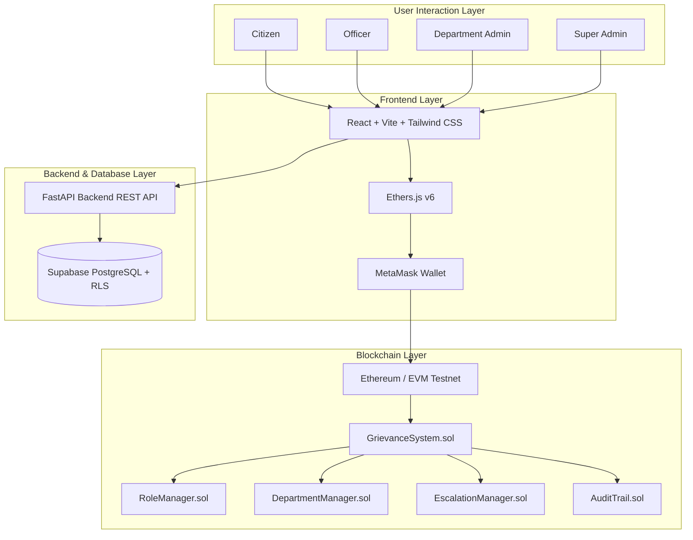

# System Architecture & Technical Design

## 1. Overview
The **Blockchain-Based Public Grievance Tracking System** is built on a hybrid architecture designed to achieve 100% data privacy for Personal Identifiable Information (PII) while ensuring immutable, tamper-evident auditability for every critical grievance lifecycle event.

---

## 2. Layer Responsibilities

### Frontend (React + Vite + Tailwind CSS + Ethers.js)
- Role-specific workspaces (Citizen, Officer, Department Admin, Super Admin).
- MetaMask wallet connection and transaction signing.
- Off-chain text hashing (SHA-256 / Keccak-256) before contract invocation.
- Independent blockchain verification tool.

### Backend (FastAPI + Pydantic)
- User authentication & session management.
- Multi-layer Role-Based Access Control (RBAC).
- Off-chain storage of PII, descriptions, notes, and evidence metadata.
- Hashing utilities and audit timeline synthesis.

### Database (Supabase PostgreSQL)
- Relational schema for profiles, grievances, evidence metadata, resolutions, notifications, and SLA settings.
- Row Level Security (RLS) policies for data isolation.

### Blockchain (Solidity Smart Contracts)
- `RoleManager.sol`: Access control roles (`CITIZEN_ROLE`, `OFFICER_ROLE`, `DEPARTMENT_ADMIN_ROLE`, `SUPER_ADMIN_ROLE`).
- `DepartmentManager.sol`: Active department registry and officer membership.
- `EscalationManager.sol`: Priority SLA policy thresholds and deadline tracking.
- `AuditTrail.sol`: Append-only immutable log for all actions.
- `GrievanceSystem.sol`: Sole state container and workflow coordinator.
